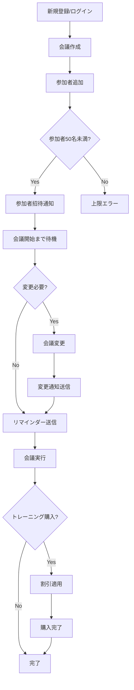

# ユーザーストーリーマッピング
# Online Calendar Application

## 🎯 ユーザージャーニー概要

| フェーズ | ユーザーアクション | ビジネスルール | エラーケース |
|---------|-------------------|----------------|--------------|
| **1. 認証・アカウント管理** | 新規登録、ログイン | メールアドレス一意性、有効形式チェック | 重複メール、無効形式、間違ったパスワード |
| **2. 会議作成・基本設定** | タイトル入力、時刻設定、重要度設定 | 必須項目チェック、時刻整合性、重複禁止 | 必須項目未入力、時刻論理エラー、スケジュール重複 |
| **3. 参加者管理** | 参加者追加・削除、通知設定 | 上限50名、オーナーのみ権限、重複防止 | 無効メール、参加者重複、上限超過、権限なし |
| **4. 会議管理・変更** | 時刻変更、会議削除 | 未来の会議のみ変更可、オーナー権限、自動通知 | 開始済み会議変更、参加者による管理操作 |
| **5. 通知・リマインダー** | 通知受信、設定カスタマイズ | 通常15分前/重要60分前、個人設定可能 | 通知設定無効、配信失敗 |
| **6. 商用機能** | コース選択、割引適用、購入 | 期間別割引、まとめ買い割引、プロモーション | 期限切れ、割引条件未達 |

## 🔄 統合フローチャート

