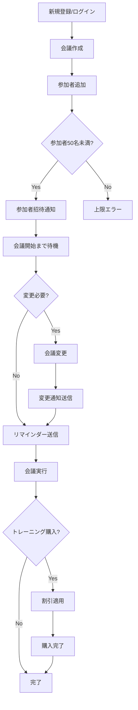

# ユーザーストーリーマッピング
# Online Calendar Application

このドキュメントは、featuresファイルから抽出したビジネス要件を基に、ユーザーの行動フローと体験を可視化したものです。

## 🎯 ユーザージャーニー概要

```
認証・登録 → 会議作成 → 参加者管理 → 会議実行 → 通知受信 → 商用機能
```

---

## 📅 Phase 1: 認証・アカウント管理
**ゴール**: システムへの安全なアクセス

### ユーザーアクション
- [ ] 新規アカウント作成
- [ ] ログイン
- [ ] パスワード認証

### ユーザーストーリー
```
As a 新規ユーザー
I want to メールアドレスとパスワードでアカウントを作成したい
So that カレンダーシステムを利用できる
```

### ビジネスルール
- ✅ メールアドレスは一意である必要がある
- ✅ 有効なメール形式のみ受け付ける
- ✅ 確認メールの送信

### エラーケース
- ❌ 既存メールアドレスでの登録
- ❌ 無効なメール形式
- ❌ 間違ったパスワード

---

## 🎪 Phase 2: 会議作成・基本設定
**ゴール**: 新しい会議の設定

### ユーザーアクション
- [ ] 会議タイトル入力
- [ ] 開始・終了時刻設定
- [ ] 重要度フラグ設定

### ユーザーストーリー
```
As a 会議オーナー
I want to 会議の基本情報を設定したい
So that 参加者に適切な会議情報を提供できる
```

### ビジネスルール
- ✅ タイトルと開始時刻は必須
- ✅ 終了時刻は開始時刻より後
- ✅ 他の会議との時間重複禁止
- ✅ 重要度による後のリマインダー設定

### エラーケース
- ❌ 必須項目未入力
- ❌ 時刻の論理エラー
- ❌ スケジュール重複

---

## 👥 Phase 3: 参加者管理
**ゴール**: 会議参加者の招待と管理

### ユーザーアクション
- [ ] 参加者メールアドレス入力
- [ ] 参加者追加・削除
- [ ] 通知設定管理

### ユーザーストーリー
```
As a 会議オーナー
I want to 参加者を招待・管理したい
So that 適切な人数で効果的な会議を実施できる
```

### ビジネスルール
- ✅ **参加者上限: 50名**
- ✅ オーナーのみ追加・削除権限
- ✅ メールアドレス重複防止
- ✅ オーナー自身の参加者追加禁止
- ✅ 参加者の自由退会
- ✅ 大文字小文字区別なし重複チェック

### デフォルト設定
- 📧 メール通知: 有効
- 📱 プッシュ通知: 無効
- 👤 表示名: メールアドレスから自動生成

### エラーケース
- ❌ 無効なメール形式
- ❌ 参加者重複
- ❌ 上限超過（50名）
- ❌ 参加者による管理操作

---

## ⚙️ Phase 4: 会議管理・変更
**ゴール**: 会議の適切な管理と更新

### ユーザーアクション
- [ ] 会議時刻変更（リスケジュール）
- [ ] 会議削除
- [ ] 参加者削除

### ユーザーストーリー
```
As a 会議オーナー
I want to 会議の詳細を変更したい
So that 状況に応じて柔軟に会議を管理できる
```

### ビジネスルール
- ✅ **未来の会議のみ変更可能**
- ✅ オーナーのみ変更権限
- ✅ 変更時は全参加者に自動通知
- ✅ 参加者の同意不要（即時適用）
- ✅ 開始済み会議は変更・削除不可

### 権限マトリックス
| アクション | オーナー | 参加者 |
|-----------|---------|--------|
| 会議変更 | ✅ | ❌ |
| 会議削除 | ✅ | ❌ |
| 参加者追加 | ✅ | ❌ |
| 参加者削除 | ✅ | ❌ |
| 自分の退会 | ✅ | ✅ |
| 通知設定変更 | ✅ | ✅ |

### エラーケース
- ❌ 開始済み会議の変更・削除
- ❌ 参加者による管理操作
- ❌ 無効な時刻設定

---

## 🔔 Phase 5: 通知・リマインダー
**ゴール**: 適切なタイミングでの通知配信

### ユーザーアクション
- [ ] 通知受信
- [ ] 通知設定カスタマイズ
- [ ] リマインダー確認

### ユーザーストーリー
```
As a 参加者
I want to 適切なタイミングでリマインダーを受け取りたい
So that 会議を忘れずに参加できる
```

### リマインダールール
- ⏰ **通常会議**: 15分前
- 🚨 **重要会議**: 60分前
- 📧 **通知チャネル**: メール / プッシュ
- 🎯 **送信精度**: 1分間の許容誤差

### 通知イベント
- 📝 会議作成通知
- 🔄 会議変更通知（MeetingRescheduled）
- 🗑️ 会議削除通知
- ⏰ リマインダー通知
- 👋 参加者退会通知

### 個人設定
- ✅ 各参加者が個別に通知設定可能
- ✅ 無効チャネルには通知なし
- ✅ 送信ステータス記録

---

## 💰 Phase 6: 商用機能（トレーニングコース販売）
**ゴール**: トレーニングコースの販売と割引適用

### ユーザーアクション
- [ ] コース選択
- [ ] 席数選択
- [ ] 割引適用
- [ ] 購入完了

### ユーザーストーリー
```
As a 企業担当者
I want to 従業員向けトレーニングコースを購入したい
So that チームのスキルアップを図れる
```

### 割引システム
| 割引タイプ | 条件 | 割引率 |
|-----------|------|--------|
| **カウントダウン** | 前日購入 | 10% |
| **アーリーバード** | 30日前購入 | 10% |
| **スーパーアーリーバード** | 60日前購入 | 30% |
| **まとめ買い** | 5席以上 | 15% |
| **ウェビナー特典** | 特定プロモーション | 固定500USD |

### ビジネスルール
- ✅ 複数割引の併用可能性
- ✅ 購入期限の自動チェック
- ✅ 席数による価格計算

---

## 🔄 統合フローチャート



---

## 📊 重要な制約とKPI

### システム制約
- 👥 **参加者上限**: 50名/会議
- ⏰ **リマインダー精度**: ±1分
- 🔒 **権限**: オーナー中心の管理
- 📧 **通知チャネル**: メール + プッシュ

### 品質指標
- 📈 会議作成成功率
- 📬 通知配信成功率
- 👥 平均参加者数
- 💰 割引利用率
- 🔄 会議変更頻度

---

## 🎯 価値提案

1. **オーナー向け**
   - 簡単な会議作成・管理
   - 柔軟な参加者管理
   - 自動通知システム

2. **参加者向け**
   - 適切なリマインダー
   - 個人設定のカスタマイズ
   - 自由な退会オプション

3. **企業向け**
   - トレーニングコース販売
   - 柔軟な割引システム
   - 大規模な参加者管理

---

*このマッピングは `/features/` ディレクトリ内のGherkin仕様から生成されています*