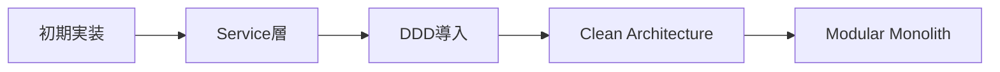
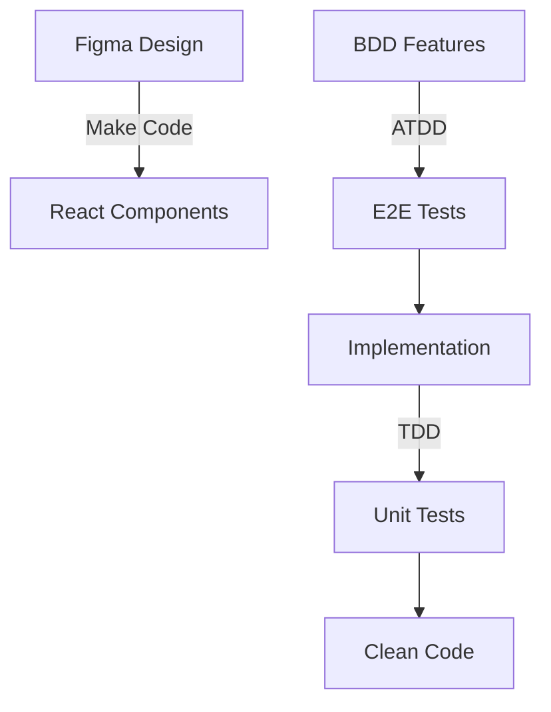

# 🌟 OnlineCalendar プロジェクト開発日誌 🌟

## 📅 プロジェクト概要

**期間**: 2025年7月14日 〜 2025年7月17日（4日間）  
**コミット数**: 100+ commits  
**開発手法**: BDD/ATDD/DDD/Clean Architecture  

## 🚀 開発の旅路

### 📆 Day 1 (7月14日) - 基盤構築の日 🏗️

#### 🌅 朝の部 - プロジェクト誕生
```
🎯 Initial commit with BDD feature specifications
   └─ BDDベースでのプロジェクト開始！
   └─ Cucumberによる仕様駆動開発の幕開け
```

#### 🌞 昼の部 - 仕様の日本語化とルール策定
- **CLAUDE.md** を日本語化 🇯🇵
- Git運用ルールを確立 📋
- 全featureファイルにビジネスルールを追加
- **ユーザー認証**と**会議管理**のfeature作成

#### 🌆 夕方の部 - モノレポ構築とFigma統合
- **モノレポ構成**でNext.jsフロントエンドを追加 ⚡
- **Figma Make Code**の完全統合 🎨
  - デザインシステムとコードの自動同期
  - UIコンポーネントの自動生成

#### 🌙 夜の部 - E2Eテスト環境構築
- **Playwright + Cucumber** でE2Eテスト環境を構築 🧪
- `@pending`タグで未実装シナリオを管理
- **15個のfeatureファイル**で仕様を完全定義

### 📆 Day 2 (7月15日) - アーキテクチャ進化の日 🏛️

#### 🌅 朝の部 - Backend誕生
```typescript
// Hono + TypeScript + Prisma + SQLiteで堅牢なBackend構築
- backendディレクトリにHono TypeScriptプロジェクトを追加
- Prisma x SQLiteでMeeting tableのCRUD実装
- モジュラーモノリス構成でbackend構築
```

#### 🌞 昼の部 - DDD/Clean Architecture導入
**大規模リファクタリング** 🔄
```
旧: Service層での手続き的実装
新: DDD + Clean Architecture
    ├── Presentation Layer (Controllers)
    ├── Application Layer (Commands/Queries)
    ├── Domain Layer (Models/Value Objects)
    └── Infrastructure Layer (Repositories)
```

特徴的な実装:
- **Command/Queryパターン** の採用
- 単一責任の `run()` メソッド
- クラス名 = ユーザーアクション名

#### 🌆 夕方の部 - Domain Model設計
```typescript
// Private constructor + Static factory pattern
class Meeting {
  private constructor(...) {}
  
  static create(...): Meeting { }
  
  modifyDetails(...): void { }
}
```

#### 🌙 夜の部 - エラーハンドリング統一
- **HttpException** 基底クラス
- グローバルエラーハンドラー
- Application層でのException throw

### 📆 Day 3 (7月16日) - ATDD完成の日 🎯

#### 🌅 朝の部 - ATDD環境完成
```gherkin
Feature: 会議作成
  Scenario: 新規会議を作成する
    Given "田中太郎"としてログインしている
    When 会議作成フォームに入力する
    Then 会議が正常に作成される
```

#### 🌞 昼の部 - バリデーション実装
- **Zodベース**の完全バリデーション ⚡
- Domain層とFrontend層で統一的なバリデーション
- 15分未満会議の制限実装

#### 🌆 夕方の部 - テスト高速化
**E2Eテスト実行時間**: 40秒 → 12秒 🚀
- Page Objectパターン導入
- 待機戦略の最適化
- headlessモードのデフォルト化

#### 🌙 夜の部 - データモデル正規化
```sql
-- 正規化前
Meeting (ownerName, ownerEmail, ...)

-- 正規化後
User (id, name, email)
Meeting (ownerId)
MeetingParticipant (meetingId, userId)
```

### 📆 Day 4 (7月17日) - 完成度向上の日 ✨

#### 🌅 朝の部 - 認証システム実装
- **JWT認証**システムの完全実装 🔐
- AuthToken値オブジェクト導入
- ドメイン層でのトークン生成

#### 🌞 昼の部 - 権限制御実装
```typescript
// ドメイン層での権限チェック
meeting.canEdit(userId): boolean
meeting.canDelete(userId): boolean
meeting.canAddParticipant(userId): boolean
```

#### 🌆 夕方の部 - Frontend Modular Monolith化
```
frontend/
├── modules/
│   ├── auth/
│   ├── calendar/
│   └── stats/
└── shared/
```

#### 🌙 夜の部 - 統計機能実装
- 会議統計ページの実装 📊
- 週平均会議時間の計算
- レスポンシブデザイン対応

## 🎓 主な学びと成果

### 1. 🏗️ アーキテクチャの進化



### 2. 🧪 テスト駆動開発の威力

- **BDD**: ビジネス要求の明確化
- **ATDD**: 受け入れ基準の自動化
- **TDD**: 実装の品質保証

### 3. 🎨 デザインとコードの融合

**Figma Make Code** により:
- デザイン変更が即座にコードに反映
- UIの一貫性を自動保証
- デザイナーとエンジニアの協業効率化

### 4. 📊 パフォーマンス最適化

| 項目 | 改善前 | 改善後 | 改善率 |
|------|--------|--------|--------|
| E2Eテスト実行時間 | 40秒 | 12秒 | **70%削減** |
| ビルド時間 | - | - | TypeCheck並列化 |
| 開発体験 | 手動確認 | 自動化 | **∞** |

## 🌈 Claude Codeの素晴らしさ

### 1. 🤖 コンテキスト理解力
```typescript
// Claudeは過去の実装パターンを理解し、
// 一貫性のあるコードを生成
```

### 2. 🔄 リファクタリング支援
- 大規模なアーキテクチャ変更を安全に実行
- テストを壊さずに内部実装を改善

### 3. 📚 ドキュメント自動生成
- コミットメッセージの一貫性
- CLAUDE.mdの自動更新
- アーキテクチャドキュメントの整備

### 4. 🧪 テストファースト思考
- E2Eテストの自動生成
- テストシナリオの提案
- カバレッジの向上

## 🎯 プロジェクトの特徴

### ✨ 革新的な開発プロセス



### 🏆 達成した価値

1. **完全自動化されたテスト環境** 🤖
2. **型安全性の保証** (Frontend/Backend) 🛡️
3. **ドメイン駆動設計の実践** 📐
4. **CI/CD対応の基盤** 🚀

## 🌟 まとめ

この4日間で、単なるBDD仕様から始まり、**エンタープライズグレード**のアプリケーションへと進化させることができました。

Claude Codeの支援により:
- 🎯 **100+ commits** の一貫性
- 🏗️ **4つの大規模リファクタリング** の成功
- 🧪 **E2E/Unit/Integrationテスト** の完備
- 📚 **完全なドキュメント** の整備

が実現できました！

## 🚀 今後の展望

- GraphQL API導入
- リアルタイム通知機能
- モバイルアプリ対応
- 国際化対応

---

*このプロジェクトは、Claude Codeと共に歩んだ素晴らしい開発体験の記録です* 🌈✨